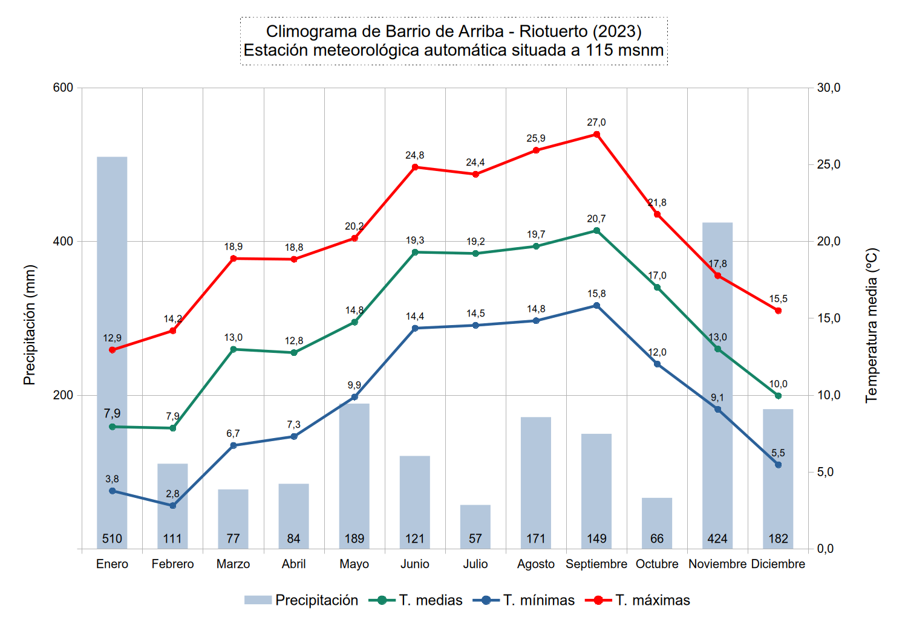
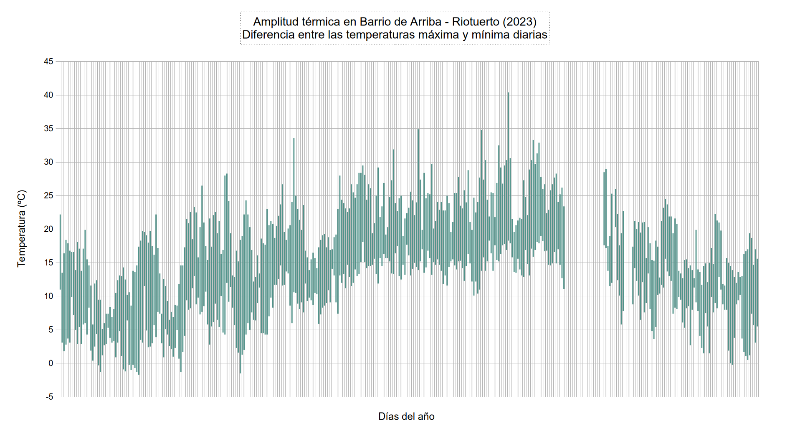
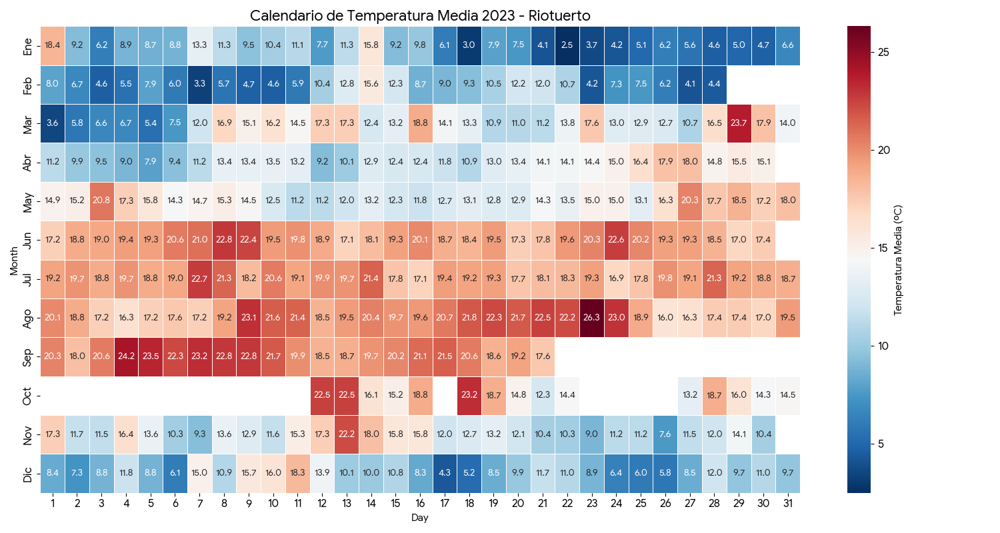
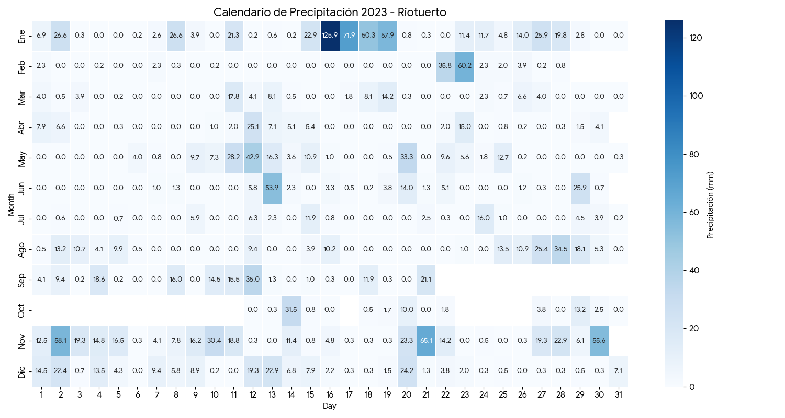
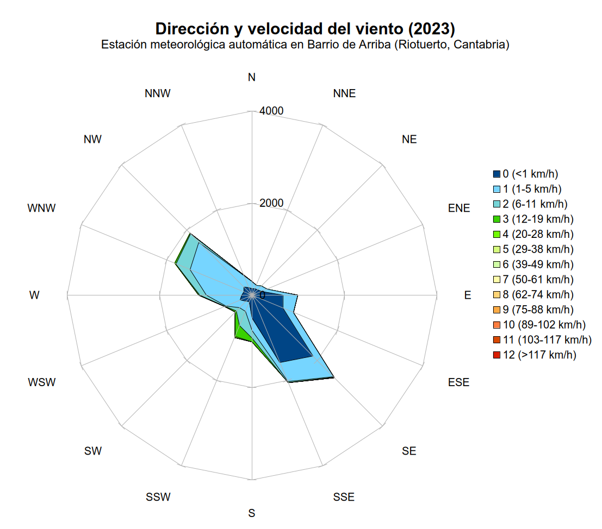
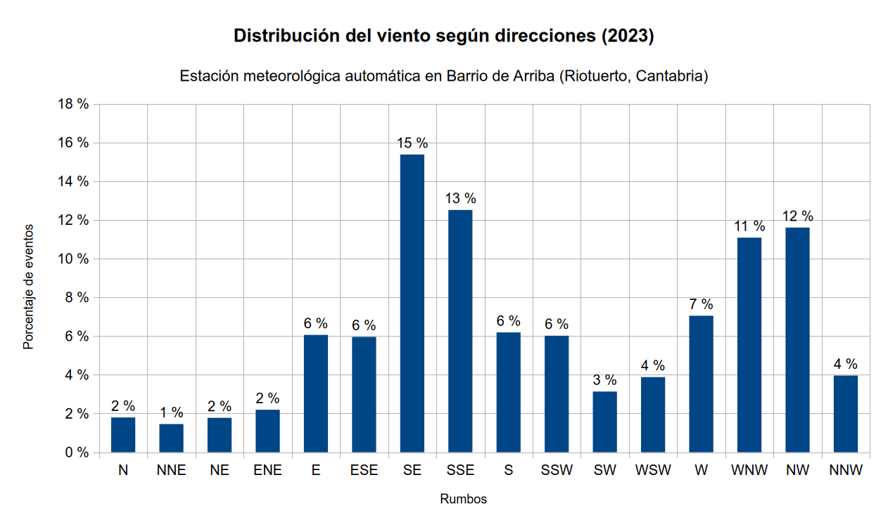
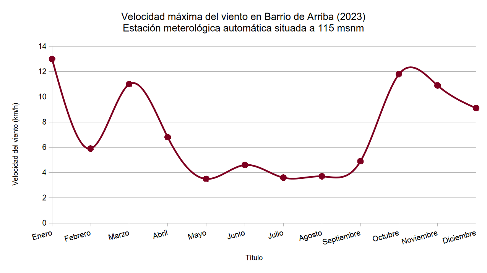
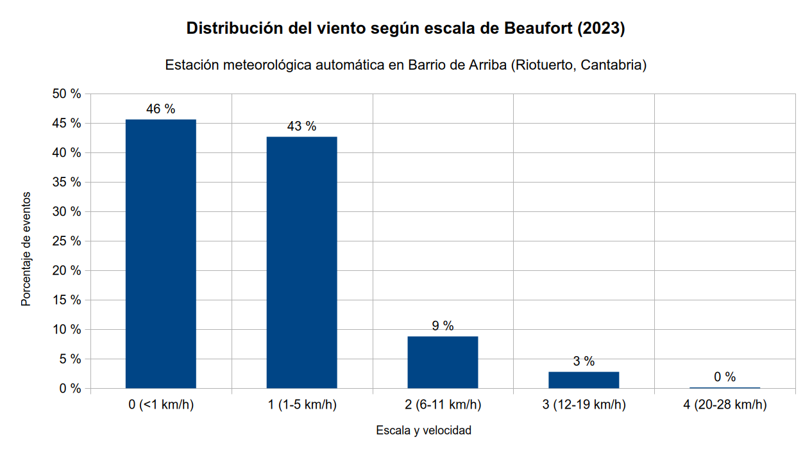

 
# 📅 Almanaque meteorológico 2023

**Barrio de Arriba, Riotuerto (Cantabria)**

El 2023 se consolida como un **muy húmedo**, superando la barrera de los **2100 mm**, aunque con una distribución estacional muy desigual. Fue un año de extremos hidrológicos: comenzó con un enero histórico por sus acumulados torrenciales (más de 500 mm) y terminó con un noviembre muy húmedo, intercalando periodos secos y cálidos como un octubre inusualmente veraniego. El comportamiento térmico fue **extremadamente cálido**, siguiendo la tendencia regional reportada por AEMET.

> **⚠️ Estado de los datos (incidencia técnica):**
> El registro anual presenta una discontinuidad significativa debido a una incidencia técnica en la estación. **No existen datos registrados entre el 22 de septiembre y el 12 de octubre** (aproximadamente 20 días).
> Por tanto, los acumulados anuales de lluvia podrían ser ligeramente superiores a los reales, y las efemérides de ese periodo (final de septiembre/principio de octubre) no han quedado registradas. El resto del año mantiene una consistencia alta con las efemérides regionales reportadas por AEMET.

---

## 📝 Descripción sinóptica

**Carácter general: extremadamente húmedo y muy cálido.**

2023 estuvo marcado por una **dualidad estacional extrema**. El invierno mostró su cara más severa en enero, con una circulación zonal baja que impactó de lleno en la cornisa cantábrica, dejando precipitaciones persistentes y muy intensas. En contraste, la primavera y el comienzo del otoño experimentaron anomalías térmicas positivas muy acusadas.

* **El "diluvio" de enero:** El año comenzó con un tren de borrascas (incluyendo las borrascas *Fien* y *Gérard*) que dejaron cantidades desorbitadas de agua, saturando los suelos del valle.
* **El "veroño" de octubre:** Octubre rompió récords de temperatura media, comportándose prácticamente como un mes de verano extendido, con noches tropicales inéditas para la época.

---

## 🌡️ Análisis térmico

El año fue cálido en su conjunto (14,4 ºC de media), impulsado por un verano largo que se extendió hasta bien entrado el otoño.

* **Media anual:** 14,4 ºC
* **Media de las máximas:** 20,0 ºC
* **Media de las mínimas:** 9,5 ºC

### Extremos y anomalías
* **Ola de calor de agosto:** El **23 de agosto** se alcanzó el techo térmico del año con **40,4 ºC** (dato horario 13:30/14:00), bajo una intensa entrada de aire cálido y viento sur. Este pico superó el umbral de los 40 grados, coincidiendo con récords regionales como los 43,3 ºC en Ramales de las Victoria registrado por la AEMET.
* **La anomalía de octubre:** Quizás el dato más sorprendente del año no sea el calor de verano, sino el de otoño. El **18 de octubre** se registró una mínima de **20,3 ºC**, una noche tropical en pleno otoño astronómico.
* **Frío moderado:** La mínima absoluta fue de **-1,7 ºC** el **11 de febrero**, en un mes caracterizado por la entrada de aire polar tras el paso de los frentes. Aunque hubo 14 días de heladas, estas no fueron severas.

---

## ☔ Análisis pluviométrico

Con **2140,4 mm**, 2023 fue un año extraordinariamente húmedo.

* **Acumulado total:** 2140,4 mm
* **Días de lluvia apreciable:** 213 días.
* **Intensidad torrencial:** Hubo 16 días con más de 30 mm y 69 días con más de 10 mm.

### Comportamiento estacional
1.  **Enero histórico:** Fue el mes más lluvioso con diferencia, acumulando **509,8 mm**. El **16 de enero** la estación recogió **125,9 mm** en 24 horas, el registro diario más alto de los últimos años ([borrasca Fien](https://www.aemet.es/es/conocermas/borrascas/2022-2023/estudios_e_impactos/fien)).
2.  **Noviembre húmedo:** El otoño meteorológico cerró con un noviembre muy activo (424,3 mm), contribuyendo decisivamente al total anual.
3.  **Julio seco:** Julio fue el contrapunto seco, con solo 56,9 mm, marcando el mínimo anual de precipitación.

---

## 💨 Viento y dinámica atmosférica

Aunque el viento medio se mantuvo moderado (2,5 km/h), los eventos de sur y las borrascas invernales dejaron su huella.

* **Racha máxima:** Se registró el **4 de noviembre** con **73,4 km/h**, coincidiendo con el paso de la [borrasca de alto impacto Domingos](https://www.aemet.es/es/conocermas/borrascas/2023-2024/estudios_e_impactos/domingos).
* **Vientos persistentes:** Se contabilizaron 43 días con rachas superiores a 40 km/h.

---

## 📝 Resumen mensual de datos

| Mes | T. Media (ºC) | T. Máx Abs (ºC) | T. Mín Abs (ºC) | Lluvia (mm) | Viento Máx (km/h) | Evento destacado |
|:---|:---:|:---:|:---:|:---:|:---:|:---|
| **Enero** | 7,9 | 22,2 | -1,3 | **509,8** | 58,7 | [Borrasca Fien](https://www.aemet.es/es/conocermas/borrascas/2022-2023/estudios_e_impactos/fien) |
| **Febrero** | 7,9 | 22,2 | **-1,7** | 110,5 | 33,2 | |
| **Marzo** | 13,0 | 28,3 | -1,3 | 77,1 | 55,0 | |
| **Abril** | 12,8 | 26,7 | -1,5 | 84,4 | 38,5 | |
| **Mayo** | 14,8 | 33,6 | 5,9 | 188,7 | 43,9 | |
| **Junio** | 19,3 | 31,9 | 11,5 | 120,6 | 40,4 | |
| **Julio** | 19,2 | 34,9 | 11,6 | **56,9** | 21,9 | |
| **Agosto** | 19,7 | **40,4** | 10,1 | 171,1 | 34,9 | Ola de calor histórica el día 23 |
| **Septiembre** | **20,7** | 33,3 | 11,1 | 149,4 | 48,0 | |
| **Octubre** | 17,0 | 29,0 | 5,8 | 66,1 | 68,1 | “Veranillo” de San Miguel prolongado |
| **Noviembre** | 13,0 | 24,5 | 2,7 | 424,3 | **73,4** | Tren de borrascas (Ciarán) |
| **Diciembre** | 10,0 | 22,3 | -0,2 | 181,5 | 55,0 | |

---

## ☀️ Radiación solar

* **Pico máximo de energía:** 1533,5 W/m² (Dato estimado puntual, posiblemente reflejo de nubosidad o borde de nube) registrado en noviembre. El comportamiento general siguió la curva astronómica habitual con máximos en junio-julio cercanos a los 1000-1100 W/m².

---

## 📊 Galería visual y análisis gráfico

### 1. Dinámica termo-pluviométrica

| Climograma anual | Rango de temperaturas (Máx/Mín) |
| :---: | :---: |
|  |  |

> **💡 Análisis:**
> * **El climograma** ilustra la desmesura de **enero y noviembre**, cuyas barras de precipitación dominan el gráfico. También destaca el "valle" seco de julio.
> * **El gráfico de rangos** muestra la estabilidad del verano interrumpida por el pico agudo del 23 de agosto (40,4 ºC). También es notable la amplitud térmica de marzo (día 28 con 23,7 ºC de diferencia).

### 2. Calendarios visuales (Mapas de calor)

**Calendario de temperatura media diaria:**

**Calendario de precipitación diaria:**

> **💡 Análisis:**
> * **El mapa térmico (temperatura):** Permite ver claramente cómo **septiembre fue el mes más cálido en promedio** incluso más que julio o agosto, que tuvieron picos puntuales pero medias más bajas. Octubre aparece inusualmente cálido para la época.
> * **El mapa hídrico (precipitación):** Enero fue un mes de lluvia casi diaria e intensa. Noviembre replica este patrón. El contraste con los días secos de julio y octubre es evidente.

### 3. Régimen de vientos

| Radar de viento (Dirección/Velocidad) | Rosa de los vientos (Distribución) |
| :---: | :---: |
|  |  |

| Rachas máximas diarias | Frecuencia (Escala Beaufort) |
| :---: | :---: |
|  |  |

---

## 📈 Ficha estadística anual

Resumen detallado de valores extremos y promedios registrados durante 2023.

| Categoría | Parámetro | Valor | Fecha / Notas |
| :--- | :--- | :--- | :--- |
| **🌡️ Temperaturas** | Media anual | **14,4 ºC** | |
| | Máxima absoluta | **40,4 ºC** | 23 de agosto |
| | Mínima absoluta | **-1,7 ºC** | 11 de febrero |
| | Media de las máximas | 20,0 ºC | |
| | Media de las mínimas | 9,5 ºC | |
| | Máxima más baja (día frío) | 5,1 ºC | 23 de enero |
| | Mínima más alta (noche cálida) | 20,3 ºC | 18 de octubre (Noche tropical) |
| | Mayor oscilación térmica | 23,7 ºC | 28 de marzo |
| **❄️ Días de Tª** | Heladas (Mín ≤0 ºC) | 14 días | |
| | Calor (>30 ºC) | 13 días | |
| | Calor intenso (>35 ºC) | 1 día | |
| | Calor extremo (>40 ºC) | 1 día | |
| **☔ Precipitaciones** | **Acumulado total** | **2140,4 mm** | **Récord reciente** |
| | Días de lluvia (≥0,2 mm) | 213 días | |
| | Días de lluvia (≥1 mm) | 152 días | |
| | Días de lluvia (≥10 mm) | 69 días | |
| | Días de lluvia (≥30 mm) | 16 días | |
| | Máxima diaria | **125,9 mm** | 16 de enero |
| | Mes más lluvioso | Enero | 509,8 mm |
| | Mes más seco | Julio | 56,9 mm |
| **💨 Viento** | Velocidad media | 2,5 km/h | |
| | Racha máxima | **73,4 km/h** | 4 de noviembre |
| | Días con rachas >40 km/h | 43 días | |
