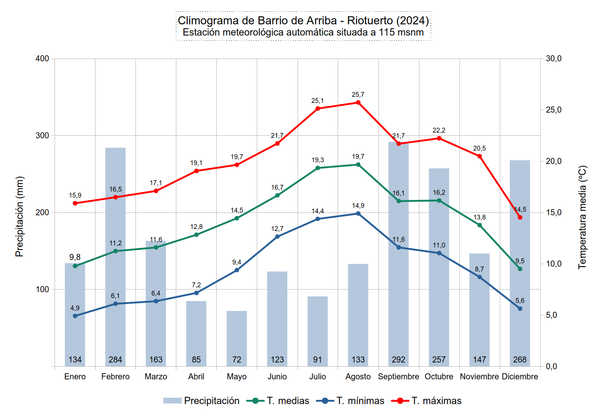
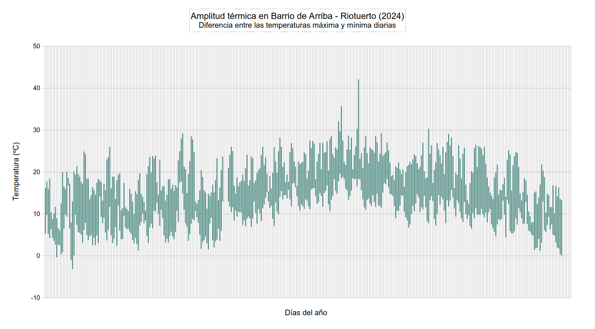
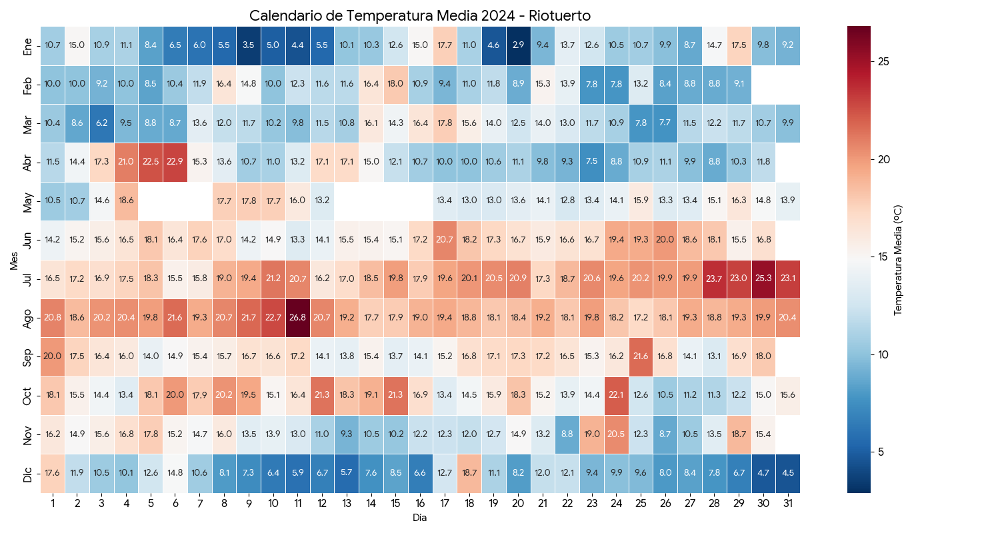
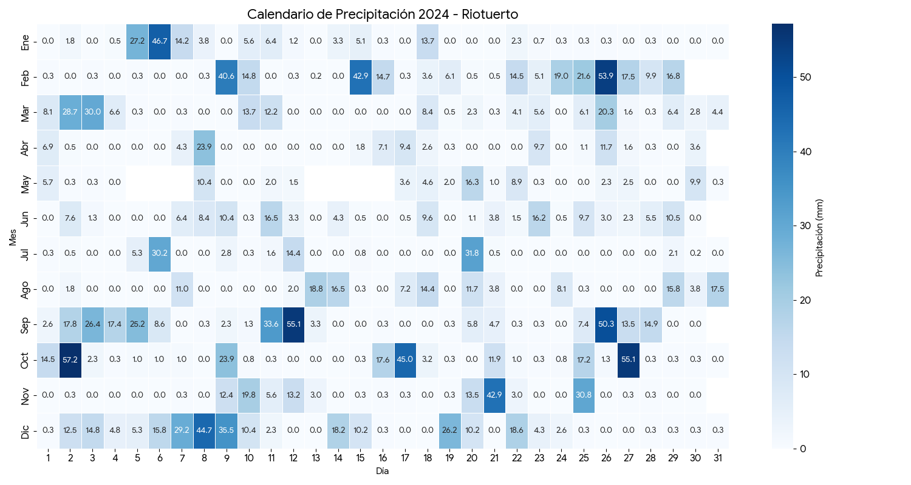
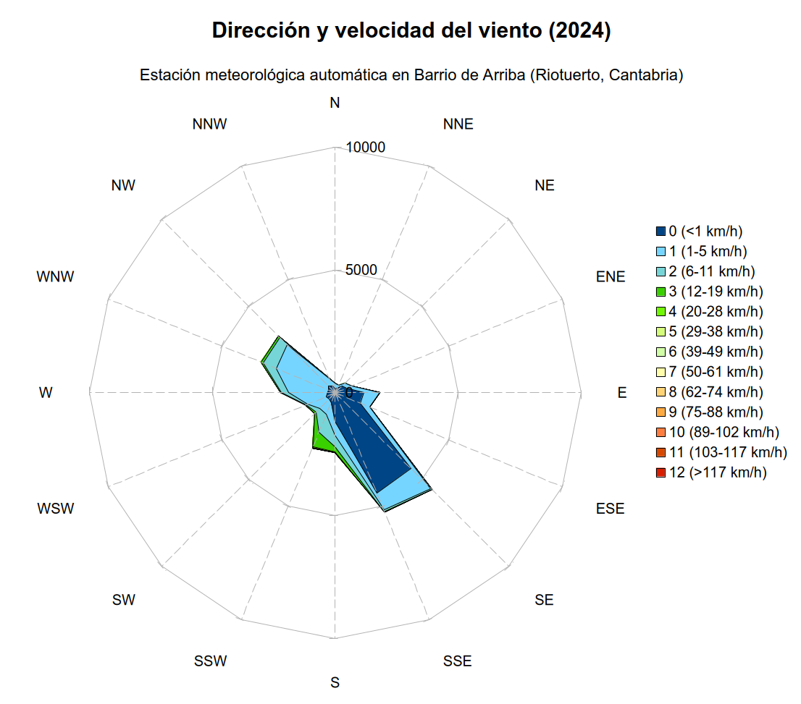
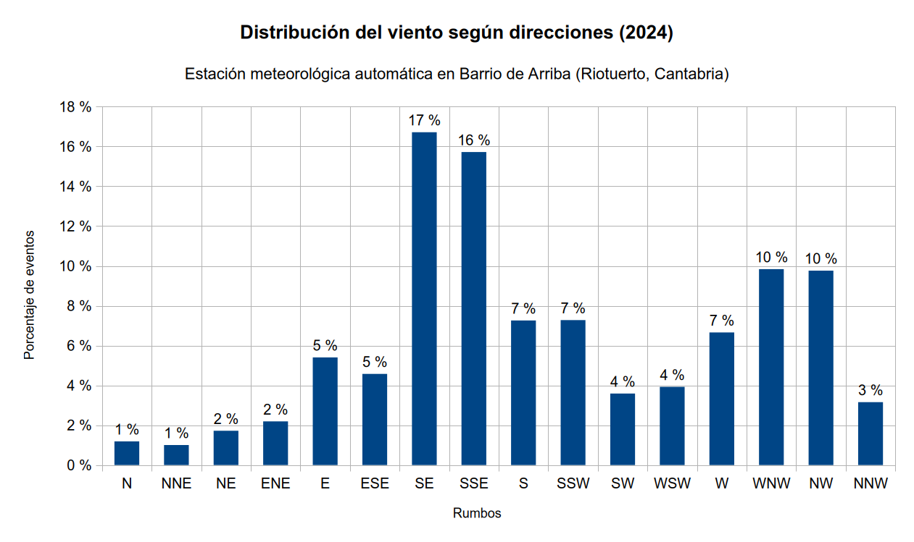
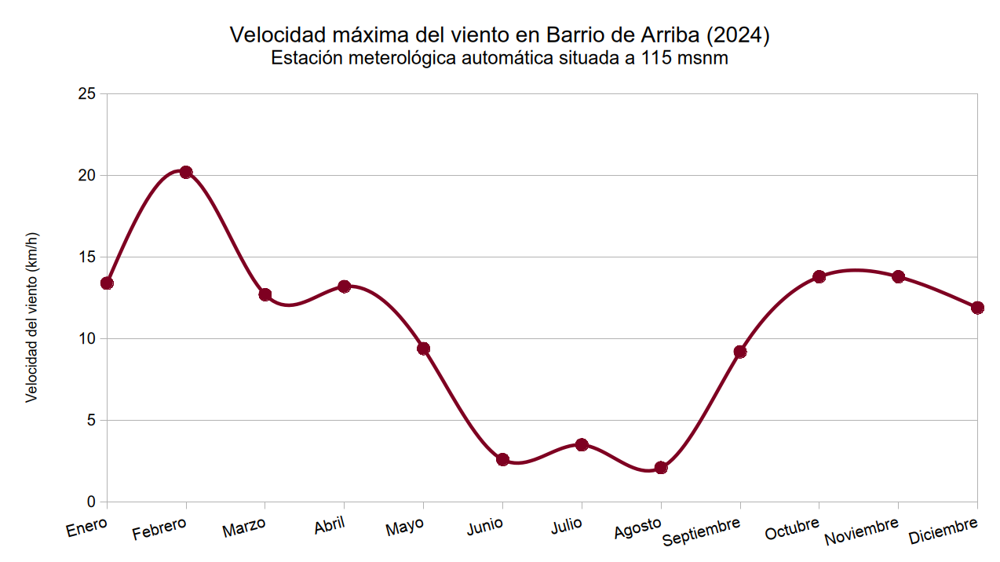

# 📅 Almanaque meteorológico 2024

**Barrio de Arriba, Riotuerto (Cantabria)**

El año 2024 quedará registrado como **uno de los más húmedos de la serie histórica**, con un acumulado excepcional superior a los **2000 mm**. A la persistencia de las lluvias se sumó una gran volatilidad térmica: aunque la temperatura media fue de 14,3 ºC, el verano dejó el récord absoluto de calor de la estación con **42,1 ºC**.

---

## 📝 Descripción sinóptica

**Carácter general: extremadamente húmedo y de contrastes térmicos agudos.**

2024 estuvo dominado por una **circulación zonal muy activa**, permitiendo el paso sucesivo de frentes atlánticos que dejaron precipitaciones constantes y abundantes, especialmente en febrero, septiembre y diciembre. A diferencia de otros años donde el verano suele ser una tregua seca, en 2024 septiembre rompió esquemas siendo el mes más lluvioso del año, marcando un final de verano abrupto y tormentoso.

Térmicamente, el año mostró la "dualidad cantábrica": inviernos suaves pero húmedos, interrumpidos por **olas de calor saharianas** en verano que, potenciadas por el viento sur, dispararon los termómetros a valores históricos en agosto.

---

## 🌡️ Análisis térmico

A pesar de la alta nubosidad y lluvia frecuente, las incursiones de aire cálido en verano elevaron la media anual.

* **Media anual:** 14,3 ºC
* **Media de las máximas:** 20,0 ºC
* **Media de las mínimas:** 9,4 ºC

### Extremos y anomalías
* **La ola de calor de agosto:** El **11 de agosto** se registró la temperatura más alta jamás medida por la estación hasta la fecha: **42,1 ºC** motiovado por un giro del viento al sur que elevó notablemente las temperaturas, máximas los mensuales, lo que motivó avisos naranjas en el sur y rojo en el resto de Cantabria por parte de la AEMET. Ese mismo día se produjo también la mayor oscilación térmica del año (**23,7 ºC** de diferencia entre el día y la noche), un claro ejemplo de advección cálida continental extrema.
* **Frío invernal:** La mínima absoluta fue de **-3,1 ºC** el **20 de enero**, siendo este el episodio más frío del año. Solo se registraron 3 días de heladas oficiales, lo que indica un invierno más húmedo y ventoso que gélido.

---

## ☔ Análisis pluviométrico

La cifra del año es **2047,9 mm**. La estación de Riotuerto funcionó como una "trampa orográfica" perfecta para los frentes del noroeste, acumulando cantidades ingentes de agua.

* **Frecuencia:** Llovió de forma apreciable en **233 días** (casi el 64% del año).
* **Intensidad:** Se registraron 17 días con acumulados superiores a 30 mm y 72 días con más de 10 mm.

### Comportamiento estacional
1.  **Otoño anticipado (septiembre):** Fue el mes más lluvioso del año con **291,7 mm**. Esto es muy inusual, ya que septiembre suele ser un mes de transición, y estuvo motivado por un paso continuados de frentes con un flujo constante de masas de aire frió y húmedo del W y NW. Apenas hubo periodos anticiclónicos.
2.  **Invierno y final de año:** Febrero y diciembre fueron meses húmedos, con 284 mm y 267 mm respectivamente.
3.  **Primavera seca:** Mayo fue el único mes relativamente seco (**71,9 mm**), dando un breve respiro antes de un verano húmedo.
4.  **Máximo diario:** El **2 de octubre** se recogieron **57,2 mm** en 24 horas, asociado a un sistema frontal que produjo precipitaciones localmente persistentes en la región.
---

## 💨 Viento y dinámica atmosférica

El año fue notablemente ventoso, superando los registros de 2025.

* **El temporal de febrero:** El **8 de febrero** la estación registró una racha huracanada de **97,2 km/h**, la máxima del año. El evento estuvo asociado a una serie de sistemas frontales de origen atlántico impulsados por la  borrasca Karlotta entre los días 7 y 10. Febrero fue un mes especialmente ventoso, castigado por el paso sucesivo de borrascas profundas.
* **Persistencia:** Hubo 43 días con rachas superiores a 40 km/h, concentrados en febrero y octubre.

---

## 📊 Galería visual y análisis gráfico

A continuación se presentan las visualizaciones generadas a partir del registro anual, que permiten identificar patrones estacionales y eventos extremos de un vistazo.

### 1. Dinámica termo-pluviométrica

| Climograma anual | Rango de temperaturas (Máx/Mín) |
| :---: | :---: |
|  |  |

> **💡 Análisis:**
> * En el **climograma** destaca la **singularidad de septiembre**: habitualmente un mes de transición, en 2024 aparece como el más lluvioso, rompiendo el patrón estival.
> * El **gráfico de rangos** captura perfectamente la **ola de calor de agosto**. Se observa un pico agudo y aislado correspondiente al 11 de agosto (42,1 ºC), contrastando con la suavidad del resto del verano.

| Calendario de temperatura media | Calendario de precipitación |
| :---: | :---: |
|  |  |

> **💡 Análisis:**
> * **Calendario de temperaturas:** En el calendario térmico destaca la segunda semana de agosto**, marcando visualmente el récord anual motivado por viento de componente sur y el efecto Foehn que propició el aviso rojo por parte de la Agencia Estatal de Meterología.
> * **Calendario de precipitaciones:** Llama poderosamente la atención la anomalía del mes de **septiembre**, como mes frío y muy húmedo en promedio. En Cantabria fue el quinto más lluvioso de la serie histórica.

### 3. Régimen de vientos

| Radar de viento (Dirección/Velocidad) | Rosa de los vientos (Distribución) |
| :---: | :---: |
|  |  |

| Rachas máximas diarias | Frecuencia (Escala Beaufort) |
| :---: | :---: |
|  |  |

> **💡 Análisis:**
> * **Canalización orográfica:** La rosa de los vientos muestra una clara predominancia de los sectores que canalizan el valle (Noroeste para lluvias/frentes y Sur para eventos cálidos).
> * **Eventos severos:** El gráfico de rachas máximas aísla visualmente el **temporal de febrero**, marcando el evento eólico más violento del año rozando los 100 km/h.

---

## 📈 Ficha estadística anual

Resumen detallado de valores extremos y promedios registrados durante 2024.

| Categoría | Parámetro | Valor | Fecha / Notas |
| :--- | :--- | :--- | :--- |
| **🌡️ Temperaturas** | Media anual | **14,3 ºC** | |
| | Máxima absoluta | **42,1 ºC** | 11 de agosto |
| | Mínima absoluta | **-3,1 ºC** | 20 de enero |
| | Media de las máximas | 20,0 ºC | |
| | Media de las mínimas | 9,4 ºC | |
| | Máxima más baja (día frío) | 6,1 ºC | 11 de enero |
| | Mínima más alta (noche cálida) | 19,6 ºC | 29 de julio |
| | Mayor oscilación térmica | 23,7 ºC | 11 de agosto |
| **❄️ Días de Tª** | Heladas (Mín ≤0 ºC) | 3 días | |
| | Calor (>30 ºC) | 5 días | |
| | Calor intenso (>35 ºC) | 2 días | |
| | Calor extremo (>40 ºC) | 1 día | (Récord anual) |
| **☔ Precipitaciones** | **Acumulado total** | **2047,9 mm** | **Año Hiperhúmedo** |
| | Días de lluvia (≥0,2 mm) | 233 días | |
| | Días de lluvia (≥1 mm) | 163 días | |
| | Días de lluvia (≥10 mm) | 72 días | |
| | Días de lluvia (≥30 mm) | 17 días | |
| | Máxima diaria | 57,2 mm | 2 de octubre |
| | Mes más lluvioso | Septiembre | 291,7 mm |
| | Mes más seco | Mayo | 71,9 mm |
| **💨 Viento** | Velocidad media | 2,5 km/h | |
| | Racha máxima | **97,2 km/h** | 8 de febrero |
| | Días con rachas >40 km/h | 43 días | |
