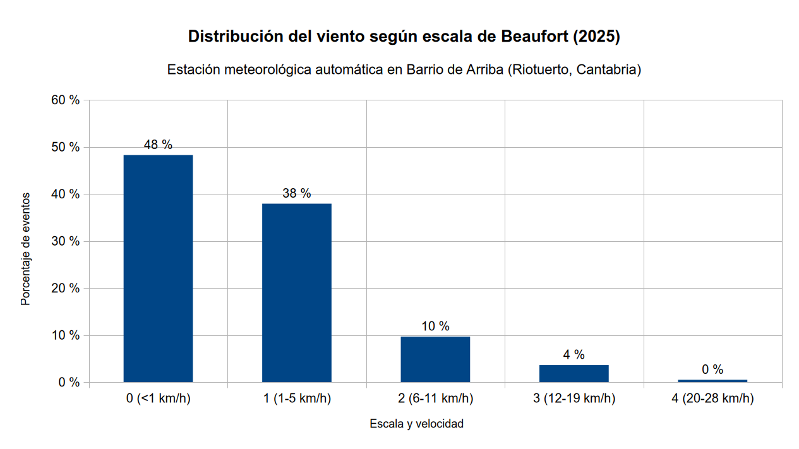

# 📅 Almanaque meteorológico 2025

**Barrio de Arriba, Riotuerto (Cantabria)**

## 📝 Descripción sinóptica del año 2025

**Carácter general: Muy húmedo y cálido.**

El año 2025 en la estación de Barrio de Arriba (Riotuerto) se define climáticamente por una marcada **anomalía pluviométrica positiva** y un comportamiento térmico suave, interrumpido por episodios extremos de corta duración. La circulación atmosférica estuvo dominada por el paso frecuente de frentes atlánticos, intercalados con incursiones de aire subtropical y eventos de viento sur (efecto Foehn) característicos del valle del Miera/Covadal.

### Comportamiento termométrico
Con una **temperatura media anual de 14,7 ºC**, el año se sitúa en valores propios de un año cálido para la cornisa cantábrica interior.
* **Invierno:** Se observaron episodios de enfriamiento nocturno significativos, destacando la mínima absoluta de **-2,2 ºC** (14 de enero), asociada a una situación de estabilidad post-frontal e inversión térmica en el valle.
* **Verano:** La estación cálida presentó un perfil irregular. Si bien la tónica general fue moderada, el **15 de agosto** se registró un evento extraordinario de calor con **40,2 ºC**, provocado por una entrada de aire cálido del sur que disparó la temperatura y desplomó la humedad relativa, un patrón recurrente en la zona de Riotuerto debido a la orografía.

### Comportamiento pluviométrico
El año ha resultado **extremadamente húmedo**, con un acumulado de **1706,9 mm**. La precipitación fue persistente (apreciable en el 59% de los días), lo que indica un predominio de la circulación zonal del oeste (borrascas atlánticas) sobre los bloqueos anticiclónicos.

---

## 🌡️ Análisis térmico

El perfil térmico del año respondió al clásico patrón de valle cantábrico: inviernos moderados pero con inversiones térmicas puntuales, y un verano cálido con temperaturas contenidas, salvo por episodios exacerbados por el efecto Foehn (viento sur).

* **Media anual:** 14,7 ºC
* **Media de las máximas:** 20,5 ºC
* **Media de las mínimas:** 9,5 ºC

Se registraron **15 días** con temperaturas superiores a 30 ºC, concentrados principalmente en la segunda quincena de julio y agosto.

### Extremos y anomalías
* **El día más frío:** La madrugada del **14 de enero** el termómetro bajó hasta los **-2,2 ºC**, en medio de un episodio de ola de frío que dejó 10 días de heladas durante el invierno.
* **El día más caluroso:** El **15 de agosto** se registró la máxima absoluta de **40,2 ºC**. Este evento coincidió con la temperatura mínima más alta del año (19,4 ºC) el día anterior, configurando 48 horas de estrés térmico inusual.
* **Oscilación térmica:** El **6 de septiembre** se observó la mayor amplitud del año (**23,6 ºC** de diferencia entre mínima y máxima en un solo día), típica de días despejados de final de verano donde el valle se calienta rápido por el día y enfría súbitamente al anochecer.

---

## ☔ Análisis pluviométrico

El dato más relevante de 2025 es la pluviometría: **1.706,9 mm** acumulados. Esta cifra sitúa al año muy por encima de la media nacional y refuerza el carácter lluvioso de esta zona de Trasmiera.

* **Acumulado total:** 1706,9 mm
* **Días con lluvia apreciable (≥0,2 mm):** 218 días. Este datos de persistencia hace que no solo destaque la cantidad, sino la frecuencia ( **6 de cada 10 días** el suelo recibió agua.)
* **Intensidad:** Se registraron 9 días con acumulados superiores a 30 mm (lluvias fuertes) asociados a frentes activos del noroeste.

### Comportamiento estacional
1.  **Otoño (estación más lluviosa):** Noviembre fue extraordinariamente húmedo, acumulando **286,4 mm** y registrando el día más lluvioso del año (24 de noviembre con 67,8 mm). Curiosamente, octubre fue el mes más seco del año (77,2 mm), debido a un bloqueo anticiclónico persistente, rompiendo la tendencia habitual del otoño cantábrico.
2.  **Invierno:** Muy activo, con 467 mm acumulados entre diciembre, enero y febrero.
3.  **Verano:** Aunque suele ser la estación seca, julio y agosto sumaron más de 200 mm.

---

## 💨 Viento y dinámica atmosférica

La orografía del valle del Covadal protegió la estación de los vientos medios (solo 2,7 km/h de promedio anual), pero canalizó las borrascas invernales con fuerza. Durante el año hubo 48 días con rachas superiores a 40 km/h, concentrados principalmente en los meses invernales y en los episodios de viento sur. El **26 de enero** se registró la racha máxima absoluta de **86,4 km/h**. Este evento estuvo asociado a una profunda borrasca que afectó a toda la cornisa cantábrica (borrasca Herminia).

---

## 📝 Resumen mensual de datos

| Mes | T. Media (ºC) | T. Máx Abs (ºC) | T. Mín Abs (ºC) | Lluvia (mm) | Viento Máx (km/h) |
| :--- | :---: | :---: | :---: | :---: | :---: |
| **Enero** | 10,2 | 22,2 | **-2,2** | 156,9 | **86,4** |
| **Febrero** | 10,9 | 22,5 | 0,4 | 144,9 | 69,8 |
| **Marzo** | 10,9 | 23,0 | -0,6 | 162,8 | 78,9 |
| **Abril** | 14,1 | 28,4 | 3,6 | 112,0 | 48,0 |
| **Mayo** | 14,5 | 32,2 | 3,9 | 130,7 | 33,2 |
| **Junio** | 19,4 | 35,5 | 9,4 | 113,5 | 36,7 |
| **Julio** | 19,1 | 30,0 | 10,7 | 85,4 | 18,3 |
| **Agosto** | **20,3** | **40,2** | 11,0 | 121,1 | 31,4 |
| **Septiembre** | 17,1 | 37,4 | 6,0 | 150,2 | 40,4 |
| **Octubre** | 15,7 | 29,3 | 4,9 | **77,2** | 64,4 |
| **Noviembre** | 12,9 | 29,0 | 0,4 | **286,4** | 66,3 |
| **Diciembre** | 10,5 | 21,3 | -0,5 | 165,8 | 77,1 |

---

## ☀️ Radiación solar

* **Pico máximo de energía:** 1040,2 W/m² el 5 de junio.
* **Índice UV máximo:** Valor de 10 (Muy Alto) registrado también a principios de junio, coincidiendo con los días de mayor elevación solar y cielos despejados previos al calor estival.

## 📊 Galería visual y análisis gráfico

A continuación se presentan las visualizaciones generadas a partir del registro anual, que permiten identificar patrones estacionales y eventos extremos de un vistazo.

### 1. Dinámica termo-pluviométrica

| Climograma anual | Rango de temperaturas (Máx/Mín) |
| :---: | :---: |
|  |  |

**Calendario de precipitación y temperatura media:**

> **💡 Análisis:**
> * **El climograma** pone de manifiesto la anomalía otoñal: se observa claramente el "bache" pluviométrico de octubre (barra baja) flanqueado por un septiembre y un noviembre muy húmedos.
> * **El gráfico de rangos** ilustra perfectamente el "efecto acordeón" de las temperaturas en verano. Los picos agudos de agosto delatan las entradas de viento sur, donde la amplitud térmica se maximiza.
> * **El calendario** ofrece una vista de "mapa de calor" donde se aprecia la persistencia de la lluvia (celdas azules) durante casi toda la primera mitad del año, confirmando el carácter muy húmedo de este 2025.

### 2. Régimen de vientos

| Radar de viento (Dirección/Velocidad) | Rosa de los vientos (Distribución) |
| :---: | :---: |
|  |  |

| Rachas máximas diarias | Frecuencia (Escala Beaufort) |
| :---: | :---: |
|  |  |

> **💡 Análisis:**
> * **Canalización orográfica:** La rosa de los vientos y el radar muestran direcciones predominantes muy marcadas, evidencia de cómo el valle del Covadal "guía" el flujo de aire.
> * **Intensidad:** El gráfico de rachas máximas corrobora el evento extremo de enero (pico superior a 80 km/h). La gráfica de Beaufort indica que, si bien predominan las calmas y ventolinas (sectores grandes), existe un porcentaje relevante de días con vientos que superan la fuerza 4-5, asociados al paso de frentes atlánticos.

---

## 📈 Ficha estadística anual

Resumen detallado de valores extremos y promedios registrados durante 2025.

| Categoría | Parámetro | Valor | Fecha / Notas |
| :--- | :--- | :--- | :--- |
| **🌡️ Temperaturas** | Media anual | **14,7 ºC** | |
| | Máxima absoluta | **40,2 ºC** | 15 de agosto |
| | Mínima absoluta | **-2,2 ºC** | 14 de enero |
| | Media de las máximas | 20,5 ºC | |
| | Media de las mínimas | 9,5 ºC | |
| | Máxima más baja (día frío) | 8,5 ºC | 15 de marzo |
| | Mínima más alta (noche cálida) | 19,4 ºC | 14 de agosto |
| | Mayor oscilación térmica | 23,6 ºC | 6 de septiembre |
| **❄️ Días de Tª** | Heladas (Mín ≤0 ºC) | 10 días | |
| | Calor (>30 ºC) | 15 días | |
| | Calor intenso (>35 ºC) | 5 días | |
| | Calor extremo (>40 ºC) | 1 día | |
| **☔ Precipitaciones** | **Acumulado total** | **1706,9 mm** | |
| | Días de lluvia (≥0,2 mm) | 218 días | |
| | Días de lluvia (≥1 mm) | 158 días | |
| | Días de lluvia (≥10 mm) | 53 días | |
| | Días de lluvia (≥30 mm) | 9 días | |
| | Máxima diaria | 67,8 mm | 24 de noviembre |
| | Mes más lluvioso | Noviembre | 286,4 mm |
| | Mes más seco | Octubre | 77,2 mm |
| **💨 Viento** | Velocidad media | 2,7 km/h | |
| | Racha máxima | **86,4 km/h** | 26 de enero (B. Hermigia) |
| | Días con rachas >40 km/h | 48 días | |
| **☀️ Otros** | Radiación solar máx. | 1040,2 W/m² | 5 de junio (UVI 10) |

> *Nota: Los datos proceden de la estación meteorológica automática Sainlogic WS3500 emitiendo a través de una puerta de enlace Ecowitt GW1200.
