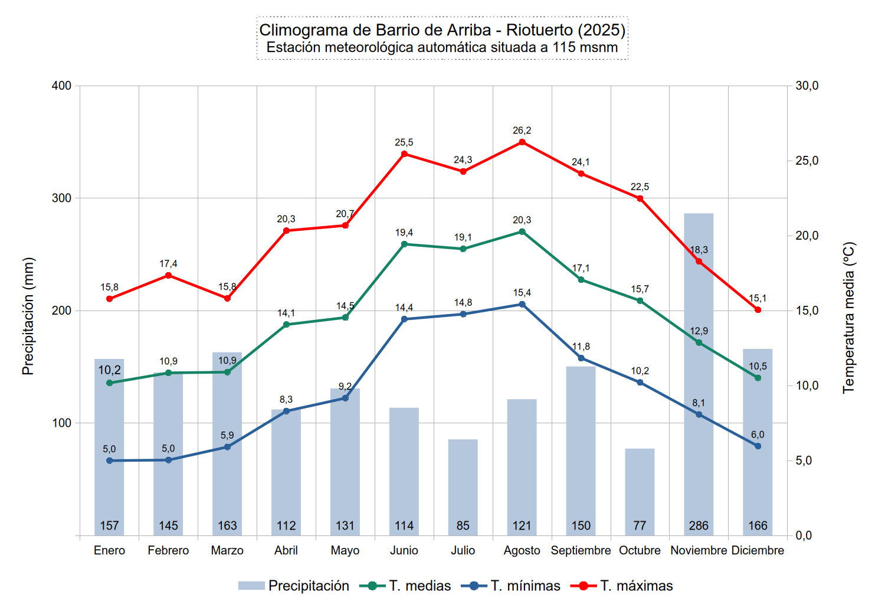
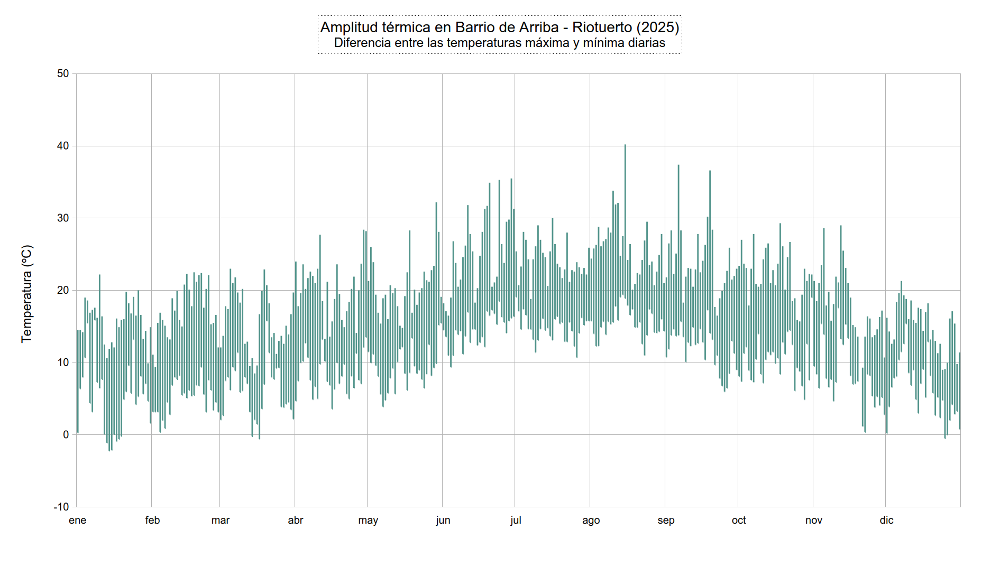
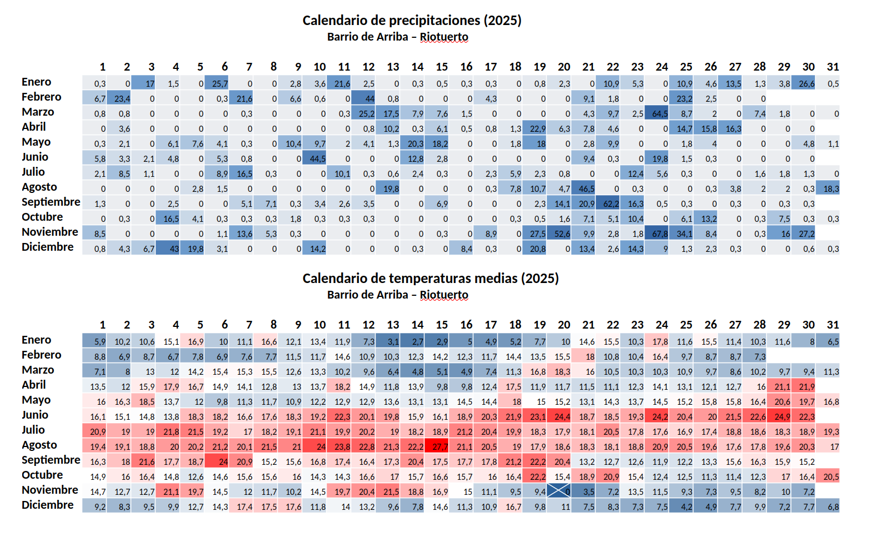
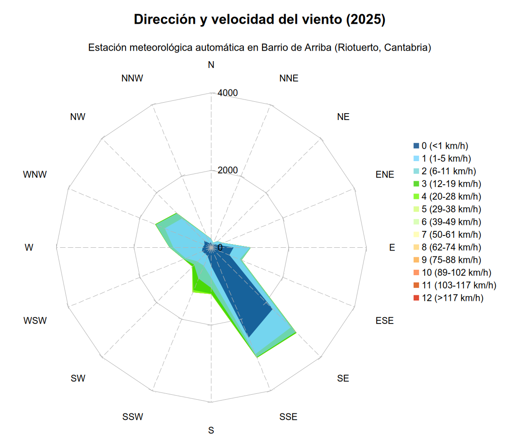
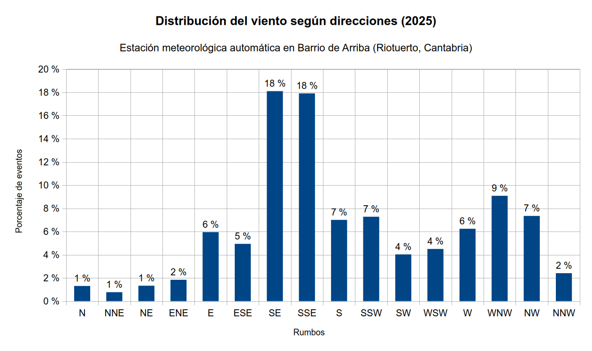
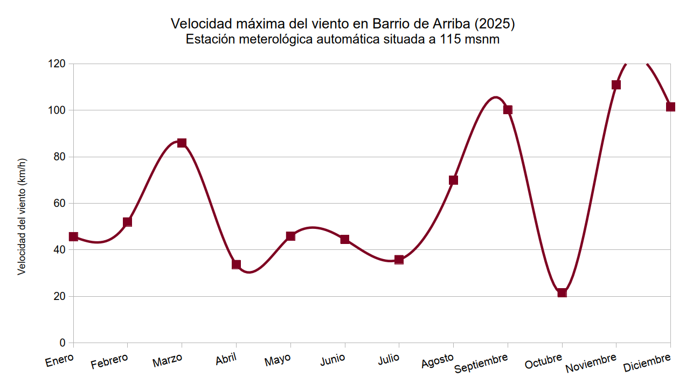

# 🌦️ MeteoRiotuerto

**Repositorio de datos meteorológicos históricos de la estación automática en Barrio de Arriba, Riotuerto (Cantabria).**

Este proyecto almacena, procesa y visualiza los registros climáticos recogidos ininterrumpidamente, ofreciendo recursos tanto para aficionados a la meteorología como para estudios climáticos locales.

---

## 📍 Ubicación y geografía

La estación se encuentra en una ubicación geográfica particular que define su microclima:

* **Coordenadas:** [43.340920, -3.669827](https://www.openstreetmap.org/#map=14/43.34090/-3.67020&layers=VN) (WGS84 Lat Lon)
* **Altitud:** 115 msnm
* **Localidad:** Barrio de Arriba, Riotuerto (Cantabria, España).

Situada en el **valle del río Covadal** (afluente del Miera), la estación se ubica en las estribaciones de la Cordillera Cantábrica, a 14 km de la costa y 5 km del puerto de Alisas.

### Particularidades climáticas
1.  **Efecto orográfico:** La orientación noroeste del valle facilita la entrada de aire húmedo desde el mar Cantábrico, incrementando las precipitaciones.
2.  **Efecto Foehn (suradas):** La zona es propensa a vientos del sur que, tras ascender la cordillera y descargar su humedad, descienden hacia el valle secos y cálidos. Esto provoca aumentos bruscos de temperatura y descensos notables de la humedad relativa.

---

## ⚙️ Ficha técnica de la estación

* **Hardware:** Sainlogic WS3500.
* **Conectividad:** Puerta de enlace Ecowitt GW1200.
* **Instalación:** Mástil de 3 metros sin obstáculos circundantes.
* **Inicio de registros:** 29 de noviembre de 2020.
* **Zona horaria:** UTC+1 (Horario peninsular español).

### Variables monitorizadas
La estación recopila datos cada 30 minutos de los siguientes parámetros:
* 🌡️ **Temperatura:** Exterior, sensación térmica y punto de rocío.
* 💧 **Humedad:** Relativa exterior.
* 💨 **Viento:** Velocidad media, dirección y ráfagas (rachas).
* ☔ **Precipitación:** Tasa de lluvia (intensidad) y acumulado diario.
* hPa **Presión atmosférica:** Relativa y absoluta.
* ☀️ **Radiación:** Radiación solar e índice UV.
* ...

---

## 📂 Estructura del repositorio

Los datos están organizados por años (`/2023`, `/2024`, `/2025`). Dentro de cada año, encontrarás la siguiente estructura:

### 📄 Datos (`/data`)
Formatos CSV estandarizados (separador decimal: punto).

* **`riotuerto_YYYY_30min.csv`**: El registro completo con alta resolución (cada 30 min). Ideal para análisis detallados.
* **`riotuerto_YYYY_diario.csv`**: Resumen climatológico con una fila por día (máximas, mínimas, acumulados).

### 📊 Gráficos (`/img`)
Visualizaciones generadas a partir de los datos anuales. A continuación se muestra una **galería de ejemplo correspondiente al año 2025**:

#### Temperatura y precipitaciones
| Climograma | Amplitud térmica |
| :---: | :---: |
|  |  |

**Calendario de lluvia y temperatura media:**

#### Análisis de viento
| Dirección y velocidad (radar) | Distribución de dirección |
| :---: | :---: |
|  |  |

| Rachas máximas | Escala de Beaufort |
| :---: | :---: |
|  |  |

---

## ⚖️ Licencia y uso
Estos datos se comparten con fines divulgativos y científicos. Si utilizas este dataset, se agradece la atribución al proyecto **MeteoRiotuerto**.
